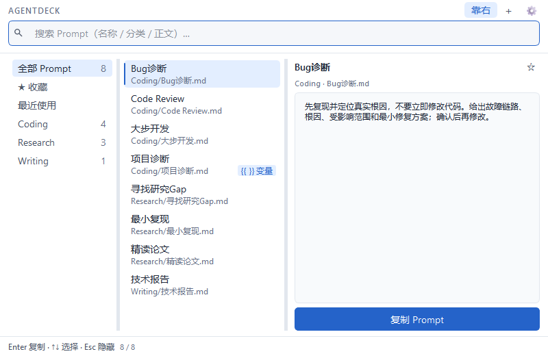
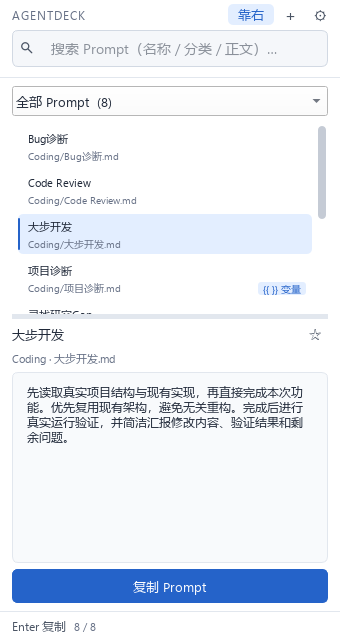
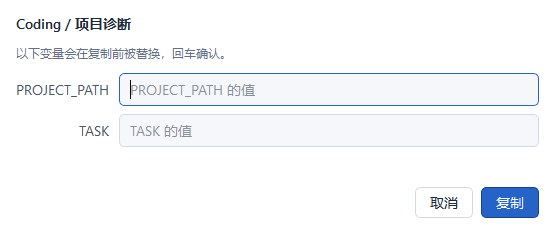

# AgentDeck

放在 Codex、DeepSeek 等 Agent 旁边的 **Prompt 启动器**。

按一次全局快捷键 → 弹出小窗口 → 输入几个字找到 Prompt → 回车 →
完整内容进剪贴板 → 回到 Agent 里 Ctrl+V。可在设置中选择复制后是否自动隐藏。



* 纯本地运行：不联网、不需要账号、不依赖数据库
* Prompt 就是 `prompts/` 目录下的普通 Markdown 文件，用 VS Code 直接编辑也可以
* 只依赖 PySide6 一个第三方库
* 白色界面，鼠标单击或键盘切换条目时，右侧预览即时更新
* 支持 Windows 原生贴靠分屏；窄窗口自动切换为上下布局，位置和尺寸自动保存

> **平台支持：目前仅支持 Windows。**
> 全局快捷键基于 Win32 `RegisterHotKey`，窗口行为也依赖 Windows 的原生贴靠分屏与
> `shell:startup` 自启。在其它系统上程序可以导入和启动，但全局热键不可用。

---

## 一、环境要求

| 项目 | 要求 |
| --- | --- |
| 操作系统 | Windows |
| Python | 3.10 及以上（开发与验证使用 3.10.11） |
| 运行依赖 | `PySide6`（开发与验证使用 6.11.2） |

---

## 二、安装与启动

### 1. 安装

在项目根目录用 PowerShell 或 cmd 执行：

```powershell
python -m venv .venv
.\.venv\Scripts\python.exe -m pip install -r requirements.txt
```

上面直接调用虚拟环境里的 `python.exe`，**不需要先激活环境**，
因此也不会遇到 PowerShell 执行策略（Execution Policy）阻止 `Activate.ps1` 的问题。
如果你更习惯激活环境：

```powershell
.\.venv\Scripts\Activate.ps1   # 若提示执行策略受限，改用上面直接调用的写法即可
```

### 2. 启动

```powershell
.\.venv\Scripts\python.exe main.py
```

启动后窗口会直接出现，同时在系统托盘留下一个图标。之后就可以把窗口关掉，
程序继续在后台待命。

> 想让 AgentDeck 开机自启：`Win+R` 输入 `shell:startup`，
> 在打开的文件夹里放一个指向 `main.py`（或 `AgentDeck.exe`）的快捷方式。

### 3. 默认全局快捷键

**`Alt + Space`**

任何程序里按它都能呼出 AgentDeck；窗口已经在前台时再按一次会隐藏。
如果这个快捷键被别的软件占用，程序启动时会在状态栏和托盘气泡里提示，
可以在 **设置** 里换一个（例如 `Ctrl+Alt+P`）。

---

## 三、日常使用

| 操作 | 效果 |
| --- | --- |
| `Alt+Space` | 呼出 / 隐藏窗口 |
| 直接输入 | 实时搜索 Prompt 名称、分类、正文 |
| `↑` `↓` | 在结果间移动 |
| `Enter` | 复制选中的 Prompt（有变量会先弹填写框） |
| 双击 | 同 `Enter` |
| `Esc` | 隐藏窗口（程序继续在后台运行） |
| `Ctrl+N` | 新建 Prompt |
| `Ctrl+E` | 编辑选中的 Prompt |
| `Ctrl+D` | 收藏 / 取消收藏 |
| `Ctrl+R` | 重新扫描 `prompts/` |
| `Ctrl+,` | 打开设置 |
| 右键点击 Prompt | 复制 / 收藏 / 编辑 / 重命名 / 删除 / 打开文件位置 |

复制成功后状态栏会闪一下 `Copied ✓`。关闭设置中的「复制后自动隐藏窗口」即可常驻显示。

**工具栏**：「靠右」将窗口放到桌面右侧，`＋` 新建 Prompt，`⚙` 打开设置。
底部「复制 Prompt」按钮可直接复制当前条目。

### 左边对话，右边使用 Prompt

拖动原生标题栏到屏幕右边缘，或将鼠标悬停在最大化按钮上，选择 Windows 的分屏布局。
也可以点击「靠右」，将 AgentDeck 放到屏幕右侧约三分之一的位置。

窗口宽度小于 720 个逻辑像素时，分类改为下拉框、列表与预览上下排列；拉宽后恢复三栏。
中间的分隔条可拖动调整列表和预览的比例。重新呼出和重启会保留窗口位置、尺寸及最大化状态。



**托盘菜单**（右键托盘图标）：显示 AgentDeck、重新加载 Prompts、设置、退出。
点窗口关闭按钮只是隐藏，真正退出程序请用托盘里的 **退出**。

---

## 四、管理 Prompt

### 新增 Prompt

在 `prompts/` 下新建 Markdown 文件即可：

```
prompts/
├── Research/
│   └── 精读论文.md
├── Coding/
│   └── Bug诊断.md
└── Writing/
    └── 技术报告.md
```

* **文件夹名** → 分类（Category）
* **文件名**（去掉 `.md`）→ Prompt 名称
* **文件正文** → 按下 Enter 时复制进剪贴板的完整内容

放好文件后按 `Ctrl+R` 或托盘里的「重新加载 Prompts」即可看到；
实际上每次按 `Alt+Space` 呼出窗口时都会自动重新扫描一遍，所以直接按快捷键就能刷出来。

### 创建分类

* 手工方式：在 `prompts/` 下新建文件夹，把 `.md` 放进去。
* 界面方式：搜索框输入 `新建` 左侧区域右键 → 「新建分类…」，或者在新建 Prompt 时
  直接在 Category 里输入一个新名字（会用这个新名字自动建目录）。

分类支持分层，例如填 `Research/2024` 会建出 `prompts/Research/2024/`。

### 收藏与最近使用

* 收藏：选中 Prompt 后按 `Ctrl+D`，或右键 →「加入收藏」。收藏的 Prompt 会出现在侧边栏顶部的「★ 收藏」里。
* 最近使用：每次真正复制后自动记录，最新的在最前，最多保留 20 条。
* 这两项都保存在 `data/config.json` 里，**不会修改 Prompt 文件本身**。

### 用界面编辑

`Ctrl+N` 新建、`Ctrl+E` 编辑、右键菜单可以重命名 / 删除 / 打开文件位置。
界面里的所有改动都会同步写成 `prompts/` 下的真实文件；
删除操作有二次确认。Windows 文件名非法字符（`< > : " / \ | ? *`）会被自动替换成 `_`。

---

## 五、变量替换

在 Prompt 正文里写 `{{变量名}}`，复制前会弹出一个小窗口让你填写：

```markdown
请检查以下项目：

{{PROJECT_PATH}}

当前任务：

{{TASK}}

要求找出真实根因，不要只修表面问题。
```

按 `Enter` 时：

1. 自动找出所有 `{{...}}`，按**首次出现顺序**排列、自动去重；
2. 弹出填写窗口，逐个填入；
3. 点「复制」后把替换完成的文本放进剪贴板。

同一个变量出现多次会被全部替换；没有变量的 Prompt 直接复制，不弹窗。
变量名支持中文，例如 `{{项目路径}}` 也可以。



`prompts/Coding/项目诊断.md` 就是一个带变量的示例。

---

## 六、设置

`Ctrl+,` 打开设置，可以改：

| 项目 | 默认值 | 说明 |
| --- | --- | --- |
| Global Hotkey | `Alt+Space` | 点进输入框后直接按组合键即可录入，也可以手输 |
| Always on Top | 开 | 窗口是否总在最前 |
| Hide after Copy | 开 | 复制后是否自动隐藏窗口 |
| Font Size | `14 px` | 整个界面的基础字体大小，范围 10–24 px；旁边有 `Reset to Default` |

字体大小改 SpinBox 时会实时预览，点「保存」后立即作用于列表、预览、分类栏、
搜索框、按钮、状态栏、所有对话框与右键菜单，不需要重启；点「取消」退回原字号。
窗口里的固定高度都已改为按字体度量计算，字号放大不会裁字或让列表行重叠。

设置保存在 `data/config.json`。旧版配置没有 `font_size` 时按默认 14 px 处理，
不报错、也不影响其他设置。

---

## 七、运行测试

先安装开发依赖（会连带安装运行依赖）：

```powershell
.\.venv\Scripts\python.exe -m pip install -r requirements-dev.txt
```

运行完整测试套件：

```powershell
.\.venv\Scripts\python.exe -m pytest tests\ -q
```

除 pytest 用例之外，`tests/` 下还有两个手动运行的验证脚本
（文件名不以 `test_` 开头，不会被 pytest 收集）：

```powershell
.\.venv\Scripts\python.exe tests\e2e_journey.py       # 真实窗口 + 真实按键的端到端验证
.\.venv\Scripts\python.exe tests\render_screenshots.py  # 重新生成 docs/screenshots/ 下的截图
```

GUI 测试默认运行在 Qt 的 `offscreen` 平台上，不会在屏幕上弹窗。

> **注意**：涉及全局快捷键的用例会真实注册 `Alt+Space`。
> 如果此时已经有 AgentDeck 在运行并占用了同一个快捷键，
> 这些用例会因为"快捷键已被其他程序占用"而失败。
> 这属于环境占用，不是程序缺陷——**先退出正在运行的 AgentDeck，再运行测试即可**。

环境自检（打包后同样可用，结果会写入 `data/selfcheck.txt`）：

```powershell
.\.venv\Scripts\python.exe main.py --check
```

---

## 八、打包成 exe

基础功能都正常之后，双击运行：

```bat
build.bat
```

脚本会检查开发依赖（缺失时从 `requirements-dev.txt` 安装）、生成图标并打包，产物是：

```
dist\AgentDeck\AgentDeck.exe
```

`prompts\` 和 `data\` 就在 exe 同目录，可以直接编辑、增删。
把整个 `dist\AgentDeck\` 文件夹拷到别处（或另一台电脑）就能直接用。

开发模式不受影响，`main.py` 照常可以运行。

### 发布方式

Windows 可执行版建议通过 **GitHub Releases** 分发（把 `dist\AgentDeck\` 打包成 zip 作为附件上传）。
源码仓库里不包含 `dist/`、`build/` 与任何 exe —— 它们都可以用 `build.bat` 重新生成。

---

## 九、目录结构

```
AgentDeck/
├── main.py                 入口
├── requirements.txt        运行依赖
├── requirements-dev.txt    开发依赖（测试与打包）
├── build.bat               打包脚本
├── LICENSE                 MIT
├── THIRD_PARTY_NOTICES.md  第三方组件许可说明
├── prompts/                Prompt 存放处（分类目录 + .md）
├── data/config.json        收藏、最近使用、窗口设置、快捷键、界面字号（本地运行数据）
├── src/
│   ├── app.py              托盘 / 全局快捷键 / 生命周期
│   ├── prompt_store.py     扫描与增删改查
│   ├── settings.py         config.json 读写
│   ├── variable_parser.py  {{VARIABLE}} 解析与替换
│   ├── hotkey.py           ctypes + RegisterHotKey
│   ├── clipboard.py        剪贴板
│   ├── paths.py            路径解析（开发 / 打包共用）
│   ├── fsutil.py           原子写入
│   ├── seeds.py            首次运行的示例 Prompt
│   └── ui/                 界面层
├── tests/                  测试与验证脚本
└── docs/                   开发说明与截图
```

---

## 十、常见问题

**按 Alt+Space 没反应？**
窗口已经在前台时再按会隐藏，这是正常的。如果一直被别的软件抢走，
打开设置换一个组合键（例如 `Ctrl+Alt+P`）。

**Alt+Space 会不会影响 Windows 自己的窗口菜单？**
会。这个快捷键被 AgentDeck 接管后，系统的「窗口控制菜单」不再响应。
如果不希望这样，请在设置里改成别的组合键。

**中文文件名、中文路径能用吗？**
可以。程序全程使用 UTF-8，`prompts/` 放在中文路径下也没问题。

**想批量改 Prompt？**
直接用编辑器改 `prompts/` 里的 `.md` 文件，然后按 `Ctrl+R` 重新扫描。

**程序关不掉？**
点 `✕` 或 `Esc` 只是隐藏。请右键系统托盘图标 →「退出」。

---

## 十一、许可证与第三方组件

AgentDeck 自身以 **MIT License** 发布，见 [LICENSE](LICENSE)。

程序运行依赖 PySide6 / Qt，打包过程使用 PyInstaller，它们属于第三方组件，
各自适用自己的许可条款。分发打包产物前请自行确认并遵守相应条款，
详见 [THIRD_PARTY_NOTICES.md](THIRD_PARTY_NOTICES.md)。

更多实现细节见 [docs/agentdeck_v01.md](docs/agentdeck_v01.md)。
